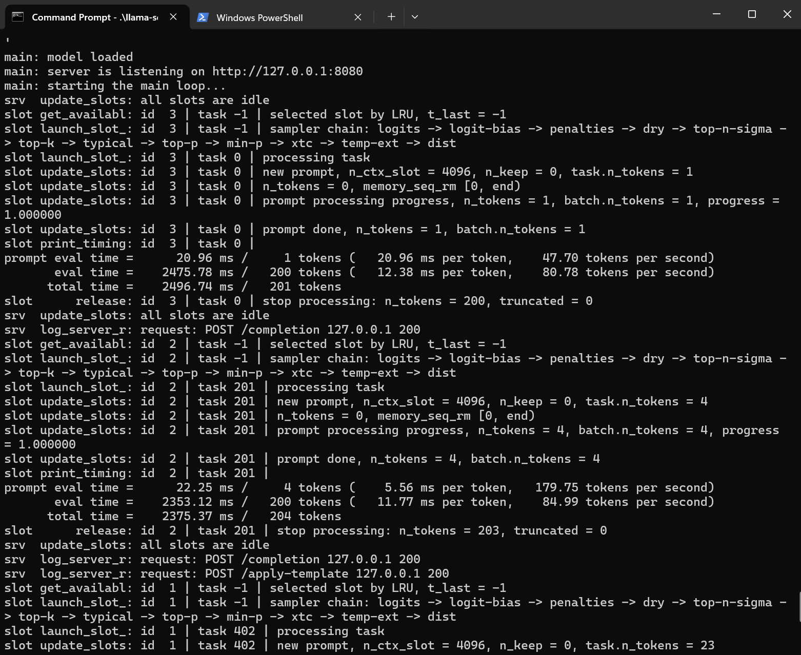
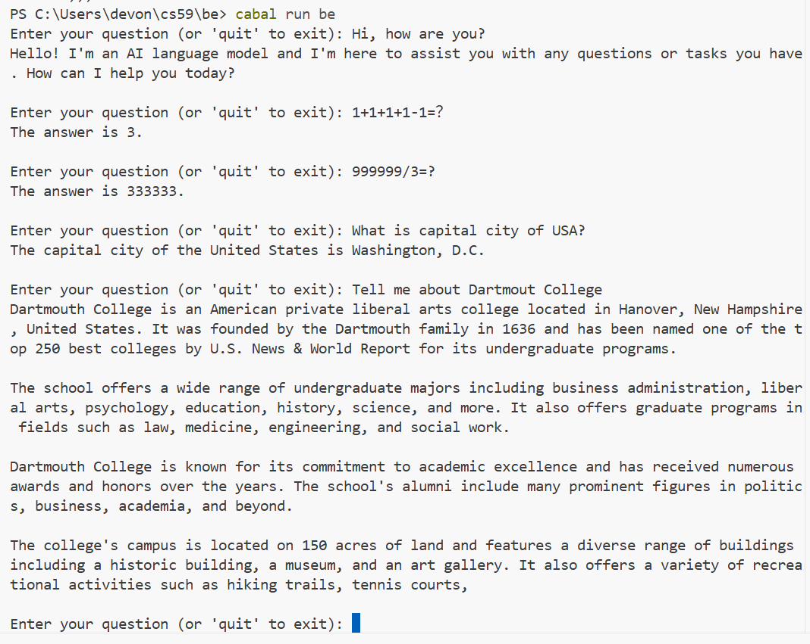
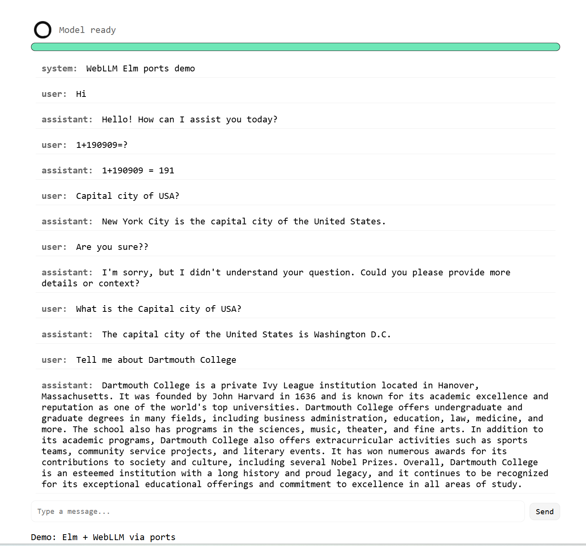

# chatbot(Qwen-0.5B) based on Elm + Haskell + llama.cpp

Live @ [\<demo link\>](https://dingziao.github.io/cs59/)

> ⚠️ First-time load is very slow.  
> After first-time load responses take ~10s because this hosted demo is using Elm + Webllm.
> This is not the speed of the full implementation!

## Back-end: 

In my proposal I said I'll try to use Haskell to host models. During my research, I found that there is currently no mature package for deploying models directly with Haskell ...

However, I found a useful package, `llama-cpp-haskell`, which acts as a bridge between `llama.cpp` and a Haskell backend.

Although this results in a less interesting tech stack:

`llama.cpp (as Model Engine)` <-> Haskell (backend) <-> Elm (Frontend)

I believe it's the most practical approach for building a chatbot with Haskell and Elm.

Implementation:
1. Run `Qwen-0.5B` with `llama.cpp`.
2. Use `llama-cpp-haskell` in `Main.hs` to connect `llama.cpp` to the backend service.

## Front-end
After comparing the design philosophies of Elm, React, and Vue. I think studying Elm's design would also be an interesting topic.

I implemented the frontend using Elm. To demonstrate a working demo without deploying `llama.cpp` and the Haskell backend to the cloud, I explored a project that isn't related to Elm's features but is interesting nonetheless: WebLLM.

I use WebLLM from Elm with ports. The live demo is a pure frontend application that requires no backend server: `Qwen-0.5B` runs in the browser. Each response takes about 10 seconds, so while WebLLM is an intriguing experiment, it is far from practical for production use.

## Some screenshots
### llama.cpp (as Model Engine)

### Haskell (Backend)

### Elm (Frontend)

